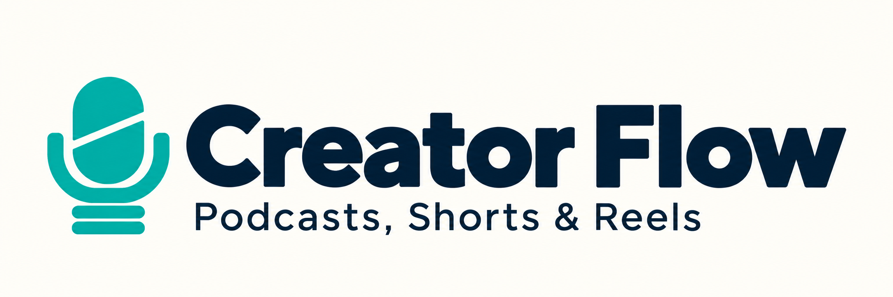
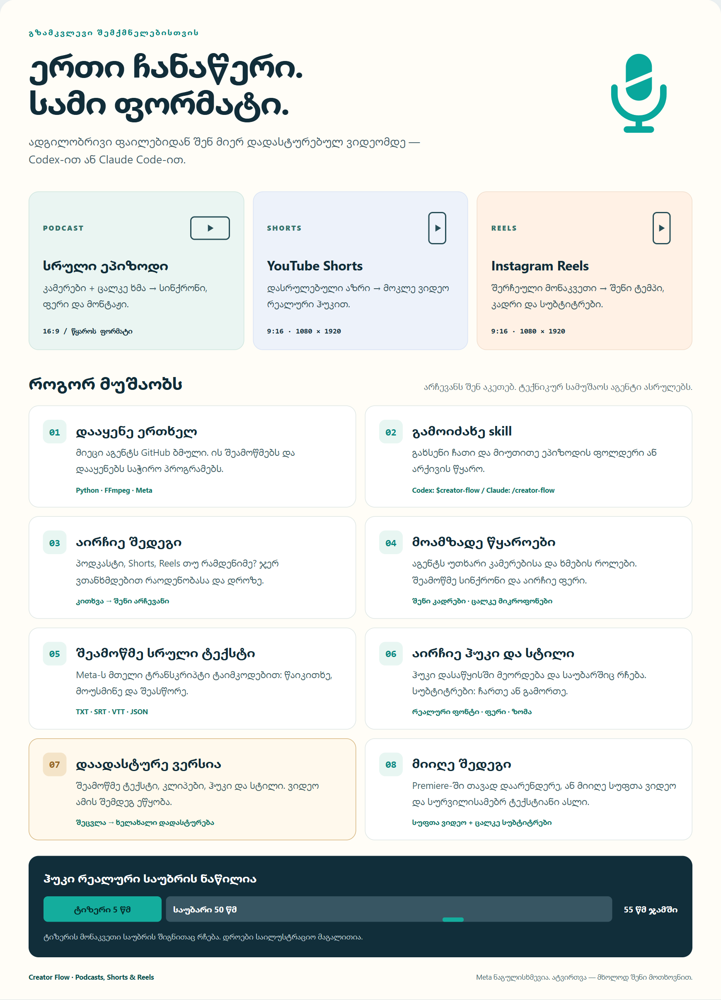
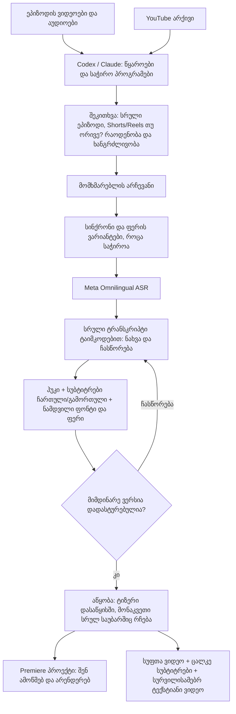
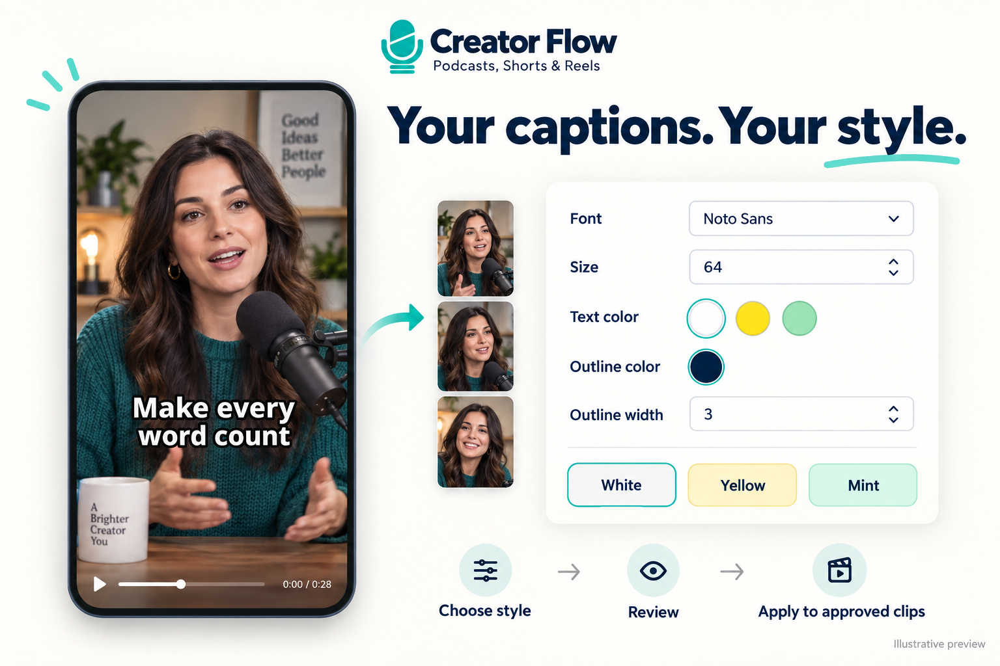

# Creator Flow | Podcasts, Shorts & Reels



**ერთი ფლოუ — სრული პოდკასტიდან Shorts-სა და Reels-მდე.**

Codex-სა და Claude Code-სთვის შექმნილი ადგილობრივი სამუშაო ინსტრუმენტები: კამერებისა და ხმების სინქრონიზაცია, ფერის არჩევა, **Meta Omnilingual ASR**, ტრანსკრიპტის გადამოწმება, ჰუკები, სუბტიტრები და Premiere ან ვიდეო. YouTube-ის არქივის ინსტრუმენტებიც აქვეა — მეორე რეპოზიტორია აღარ გჭირდება.

**Podcut Flow + YOUTUBETECHCRUSH ახლა ერთ პროექტშია.** ორივეს კოდი და ცვლილებების ისტორია შენარჩუნებულია.

[English](docs/README.en.md) · [აგენტისთვის / Start here](START_HERE.md) · [დაყენება](docs/SETUP.md) · [Shorts / Reels](docs/CLIPS.md) · [თაბნეილები](docs/THUMBNAILS.md) · [YouTube არქივი](docs/ARCHIVE.md) · [Premiere](docs/PREMIERE.md)

## პირველად აქედან დაიწყე

| ქართული | English |
| --- | --- |
| **[სრული გზამკვლევი](docs/USER_GUIDE.ka.md)** — დაყენება ჩათიდან, skill-ის გამოძახება, პოდკასტი, Shorts, Reels, ჩასწორება და შედეგები | **[Complete user guide](docs/USER_GUIDE.en.md)** — chat installation, skill invocation, podcasts, Shorts, Reels, review and delivery |

**[ორენოვანი ვიზუალური გვერდი და მზა ტექსტების კოპირება](docs/visual-guide.html)** — ჩამოტვირთული checkout-იდან გახსენი `docs/visual-guide.html` ბრაუზერში. GitHub ფაილის გვერდი HTML-ის კოდს აჩვენებს; ინტერაქტიული ღილაკები ადგილობრივად გახსნისას მუშაობს.

ჩათიდან პირველი დაყენებისთვის ჩასვი:

```text
დააყენე https://github.com/AvtandilMghebrishvili/creator-flow ამ კომპიუტერზე.
წაიკითხე START_HERE.md და docs/SETUP.md; გამოიყენე არსებული checkout, თუ არის.
დააყენე საჭირო ინსტრუმენტები Meta-სა და არქივის მხარდაჭერით.
scripts/register_skill.py-ით ამ კლიენტისთვის skill დაარეგისტრირე.
ჩემი არსებული ცვლილებები შეინარჩუნე; შეამოწმე ორივე doctor.
ეპიზოდი ჯერ არ დაამუშაო. ბოლოს მითხარი როგორ გამოვიძახო.
```

**ჩათში გამოძახება:** Codex — `$creator-flow`; Claude Code — `/creator-flow`. შემდეგ მიუწერე დავალება და ფოლდერი. ეს ტერმინალის ბრძანებები არ არის. [სრული მაგალითები და ოფიციალური წყაროები](docs/USER_GUIDE.ka.md#2-როგორ-გამოიძახო-skill).

## როგორ დაიწყო

გახსენი ადგილობრივ კომპიუტერზე მომუშავე **Codex ან Claude Code**, რომელსაც შენს ფაილებზე წვდომა აქვს, და ჩაუგდე:

```text
გამოიყენე https://github.com/AvtandilMghebrishvili/creator-flow
წაიკითხე START_HERE.md და creator-flow skill.
ეპიზოდის ფოლდერია: D:\Podcasts\Episode-01
მინდა სრული ეპიზოდი და/ან Shorts/Reels.
გამოიყენე Meta Omnilingual ASR. საჭირო ინსტრუმენტები დააყენე.
თუ ინფორმაცია გაკლია, მკითხე; უკვე მოცემული პასუხები გაითვალისწინე.
ვიდეოს აწყობამდე მაჩვენე სრული ტრანსკრიპტი ტაიმკოდებით.
```

ეპიზოდის ვიდეოები და ხმები მოათავსე **ერთ ფოლდერში**, საჭიროებისას ქვეფოლდერებით. თუ გზას არ მიუთითებ, აგენტი გკითხავს. YouTube-ის არქივიდან მუშაობისას მიუთითე შენი არხის/ვიდეოს ბმული და სამუშაო ფოლდერი. ბრაუზერის ჩვეულებრივ ჩატში GitHub ბმულის გაგზავნა დისკზე წვდომას არ იძლევა.

## ფლოუ ვიზუალურად

[](docs/USER_GUIDE.ka.md)

[English visual cards](docs/assets/creator-flow-cards-en.png) · [სრული ინსტრუქცია ქართულად](docs/USER_GUIDE.ka.md)

<details>
<summary>სქემის ტექსტური ვერსია / Editable diagram</summary>



</details>

უკვე გადამოწმებული ტრანსკრიპტი ხელახლა არ გადაიწერება მხოლოდ მოდელის შესაცვლელად. არქივის არსებული სუბტიტრებიც შეიძლება გამოვიყენოთ შემოწმების შემდეგ; **ახალი ტრანსკრიპციის ნაგულისხმევი მოდელი Meta-ა**.

## ტიტრები შენს სტილში

[](docs/USER_GUIDE.ka.md#caption-style)

აირჩიე ორიგინალი ქართული/ინგლისური ფონტი, ზომა, ტექსტის ფერი და კონტურის ფერი/სისქე. დაიწყე **White / Yellow / Mint** ვარიანტით ან მოარგე შენი პარამეტრები. დადასტურებული სტილი ავტომატურად გამოიყენება მიმდინარე ნაკრების ყველა ტექსტიან კლიპზე; სუბტიტრების ჩართვა თითო კლიპზე ცალკე ირჩევა. [როგორ მოვარგო და გამოვიყენო](docs/USER_GUIDE.ka.md#caption-style).

*გამოსახულება საილუსტრაციოა; რეალური წინასწარი ნახვა შენს ტექსტსა და ორიგინალ ფონტს იყენებს.*

[განახლების Facebook პოსტი და ქავერი](docs/social/facebook-update.ka.md) — გასაზიარებლად მომზადებული ტექსტი და ფოტო.

## თაბნეილებიც შესაბამისი შინაარსით

ფლოუ შემოგთავაზებს სრული ეპიზოდისა და თითოეული Short/Reel-ის ქავერს. სტუმრის რეალური ფოტო მარცხნივ, წამყვანის მარჯვნივ, ირგვლივ საუბრის თემაზე შექმნილი ვიზუალი. ტექსტს/მოწოდებას თავად არჩევ ან აგენტის შეთავაზებებიდან ირჩევ; თითო კლიპის ქავერი მის საკუთარ მონაკვეთს ეყრდნობა.

კლიპების გვერდზე უკვე არის **თაბნეილის არჩევანი და ტექსტის ველი**. სურათის დამზადებას აგენტი ხელმისაწვდომი გენერაციის ინსტრუმენტით ასრულებს და ნამუშევარს გადაგამოწმებინებს. [ქართული ახსნა და მაგალითი](docs/USER_GUIDE.ka.md#thumbnails) · [ტექნიკური ფლოუ](docs/THUMBNAILS.md).

## რას გკითხავს და რას მიიღებ

| ეტაპი | შენი არჩევანი / შედეგი |
| --- | --- |
| წყაროები | სტუმრის, წამყვანის და საერთო კადრი, თუ არსებობს; ცალკე მიკროფონები ან არხები |
| ერთი კადრი და საერთო ხმა | ვინ ზის მარცხნივ/მარჯვნივ და ვინ საუბრობს კონკრეტულ მონაკვეთებში; ორი დამოუკიდებელი ხმის აღდგენა გარანტირებული არ არის |
| რაოდენობა და დრო | სრულ ეპიზოდს, კლიპებს თუ ორივეს გთავაზობს შეკითხვის ფორმით; ტიზერიც ითვლება ხანგრძლივობაში |
| ფერი | თუ დამუშავება გინდა, Natural / Warm / Contrast ვარიანტებს შენი კადრებიდან გაჩვენებს |
| ტრანსკრიპტი | სრული ტექსტი ტაიმკოდებით, შენს ჩასწორებასა და დადასტურებამდე აწყობა არ იწყება |
| სუბტიტრები | თითო ვიდეოზე ჩართვა/გამორთვა; ნამდვილი ქართული/ინგლისური ფონტი, ზომა და ფერი, ან შენ მიერ მოწოდებული TTF/OTF |
| ჰუკი | რეალური ნათქვამი მონაკვეთი დასაწყისში ტიზერად და ისევ თავის ადგილზე სრულ საუბარში |
| აუდიო | დამოუკიდებელი ჩანაწერების არსებობისას სტუმრისა და წამყვანის ცალკე ტრეკები; კამერის საცნობარო ხმა საბოლოო მონტაჟიდან გამოირიცხება |
| შედეგი | Premiere პროექტი შენი რენდერისთვის ან ვიდეო; TXT / SRT / VTT / JSON და აღსადგენი სამუშაო მდგომარეობა |

ვიდეოზე მხოლოდ **ნამდვილი ფონტის ფაილები** გამოიყენება; გენერირებული ასოები/ფონტები — არა. რეპოზიტორიის საილუსტრაციო ლოგო სუბტიტრის ფონტი არ არის. დამწვარი სუბტიტრის გამორთვა უკვე ტექსტიან MP4-ში შეუძლებელია, ამიტომ სუფთა ასლიც ინახება. Premiere-ში სუბტიტრები ცალკე რედაქტირებად ტრეკზე უნდა დარჩეს.

## ერთი ინსტალაცია

აგენტმა უნდა შეამოწმოს არსებული პროგრამები, გამოიყენოს გამართული ინსტალაციები და საჭირო დანაკლისი დაამატოს. Premiere-ის ავტომატური აწყობის არჩევისას საჭირო MCP/პლაგინის დაყენება და კავშირის შემოწმებაც ფლოუს ნაწილია. Adobe-ის ლიცენზია/შესვლა ან სისტემის ინტერაქტიული ნაბიჯი შესაძლოა შენს მონაწილეობას საჭიროებდეს.

```powershell
git clone https://github.com/AvtandilMghebrishvili/creator-flow.git
cd creator-flow
.\Install.ps1 -WithArchive
.\.venv\Scripts\python.exe scripts/register_skill.py --client codex
.\.venv\Scripts\creator-flow doctor
.\.venv\Scripts\creator-flow archive doctor
```

თუ მხოლოდ ადგილობრივ ეპიზოდებზე მუშაობ, `-WithArchive` შეგიძლია გამოტოვო. macOS/Linux-ზე იგივე ინსტალატორია `python3 scripts/install.py --with-archive`. [სრული ინსტრუქცია](docs/SETUP.md).

ძირითადი კომპონენტებია Python, FFmpeg და Meta-ს ბიბლიოთეკები; არქივის არჩევანი ამატებს Node-სა და yt-dlp-ს. Meta-ს მცირე CTC 300M INT8 მოდელი პირველი ტესტისთვის ჩამოიტვირთება და ადგილობრივად მუშაობს. Whisper/შედარება სურვილისამებრ რჩება. [მოდელი, ლიცენზია და ტაიმკოდები](docs/TRANSCRIPTION.md).

## რა შედის ერთ პროექტში

| მიმართულება | ინსტრუქცია |
| --- | --- |
| ახალი პოდკასტი: წყაროები, სინქრონი, ფერი, მონტაჟი | [START_HERE.md](START_HERE.md), [ბრძანებები](docs/WORKFLOW.md) |
| Shorts / Reels: ტრანსკრიპტის გვერდი, რეალური ჰუკი და სუბტიტრები | [CLIPS.md](docs/CLIPS.md) |
| თაბნეილები: რეალური ფოტოები, შესაბამისი თემა და არჩეული ტექსტი | [THUMBNAILS.md](docs/THUMBNAILS.md) |
| YouTube არქივი: სუბტიტრების მიღება, არხის მონაცემები, მონაკვეთების ძიება | [ARCHIVE.md](docs/ARCHIVE.md) |
| Premiere: იმპორტი ან MCP, შენახვა და გადამოწმება | [PREMIERE.md](docs/PREMIERE.md) |

კლიპების მიმდინარე რენდერს სჭირდება **უკვე ექსპორტირებული ადგილობრივი ვიდეო და მასთან დროში დამთხვევადი სრული ტრანსკრიპტი**. Premiere-only რეჟიმი სრული ეპიზოდის რენდერს არ იწყებს; კლიპებისთვის გამოიყენება შენი ექსპორტი ან Premiere-ში გადამოწმებული კლიპების სეკვენსები. XML გაცვლის ფაილია — დასრულებული `.prproj` მხოლოდ Premiere-ში შენახვისა და ხელახლა გახსნის შემდეგ ჩაითვლება მზად.

ძველი `podcut` ბრძანებები, Python პაკეტის სახელი და `.podcut/` სამუშაო მდგომარეობა თავსებადობისთვის შენარჩუნებულია. მიმდინარე კოდს განვაახლებთ მხოლოდ აქ. YouTube-ზე ატვირთვა ცალკე მოთხოვნას საჭიროებს.

ეს არის აგენტის მიერ მართული ინსტრუმენტები; მოსაუბრეების, სინქრონის, ტექსტისა და მონტაჟის გადამოწმება საჭიროა. [შესაძლებლობები და შეზღუდვები](docs/LIMITATIONS.md) · [მონაწილეობა](CONTRIBUTING.md) · [MIT](LICENSE) · [ავტორობა](THIRD_PARTY_NOTICES.md).

## YouTube-ის გაფართოება Chrome / Edge-ისთვის

YouTube-ის გვერდზევე: სათაურებისა და აღწერის შემოწმება, თაბნეილის პრევიუ, Studio CSV ანალიტიკა, იდეები და არჩევითი AI კავშირი. ადგილობრივი developer ვერსია; Google OAuth და ჩაშენებული vidIQ კავშირი ჯერ არ აქვს. [დაყენება ქართულად](docs/EXTENSION.ka.md) · [English / technical guide](docs/EXTENSION.md).
