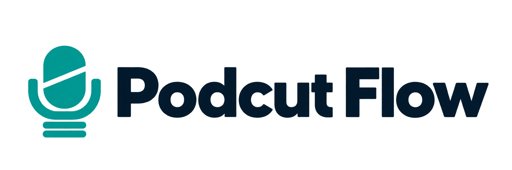
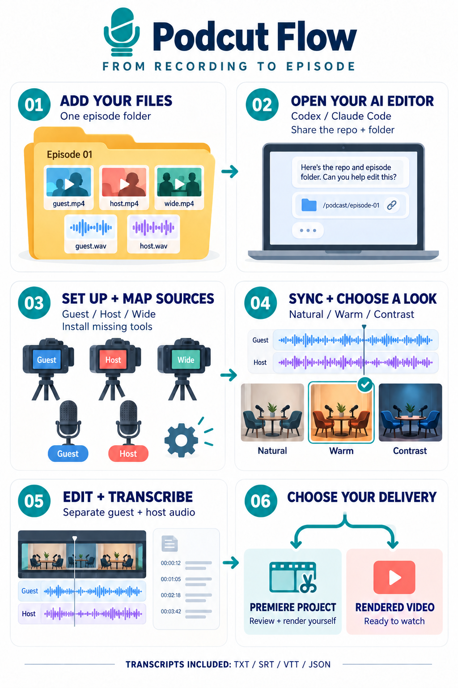

# Podcut Flow

<picture>
  <source media="(prefers-color-scheme: dark)" srcset="docs/assets/podcut-logo-dark.png">
  
</picture>

**შენი AI პოდკასტის ედითორი — ადგილობრივი ფაილებიდან სინქრონიზებულ მონტაჟამდე.**

Agent-guided podcast editing for **Codex and Claude Code**: identify the footage, synchronize cameras and microphones, choose a color look, build an edit, and deliver either an editable Premiere sequence or a rendered video. Includes local Python tools; no paid transcription API is required.

[English guide](docs/README.en.md) · [აგენტის დასაწყისი / Start here](START_HERE.md) · [დაყენება / Setup](docs/SETUP.md) · [Premiere](docs/PREMIERE.md) · [შეზღუდვები / Limitations](docs/LIMITATIONS.md)

## ფლოუ ერთი შეხედვით

[](docs/assets/podcut-workflow-guide.png)

1. **ჩაყარე ფაილები** — ერთი ეპიზოდის ვიდეოები და ხმები ერთ ფოლდერში მოათავსე.
2. **გაუზიარე აგენტს** — Codex-ს ან Claude Code-ს მიეცი ამ რეპოზიტორიის ლინკი და ეპიზოდის ფოლდერის გზა.
3. **მოამზადე გარემო** — აგენტი აყენებს დანაკლის პროგრამებს და გეკითხება, ვის ეკუთვნის თითოეული კამერა და მიკროფონი.
4. **შეამოწმე სინქრონი და აირჩიე ფერი** — ხმა და კადრები სინქრონდება; თუ ფერის დამუშავება გინდა, რეალური კადრების ვარიანტებიდან ირჩევ.
5. **მიიღე მონტაჟი და ტრანსკრიპტი** — დამოუკიდებელი მიკროფონები ცალკე ტრეკებზე რჩება; ტექსტს წყაროსა და მონტაჟის ტაიმკოდები ახლავს.
6. **აირჩიე შედეგი** — Premiere-ში აწყობილი პროექტი შენს გადასამოწმებლად და დასარენდერებლად, ან უკვე დარენდერებული ვიდეო.

სქემა საილუსტრაციო მაგალითია. საერთო კადრი და ცალკე მიკროფონები სავალდებულო არ არის; აგენტი შენს ფაილებს მოერგება. ფერის ნამდვილი ვარიანტები შენი ეპიზოდის კადრებიდან მზადდება. [ლოგოს ფაილები და გრაფიკის აღწერები](docs/assets/README.md).

## როგორ გამოიყენო

1. ერთი ეპიზოდის ვიდეოები და აუდიოები მოათავსე ერთ ფოლდერში. შიგნით დამატებითი ფოლდერებიც შეიძლება გქონდეს. ორიგინალები შეინახე.
2. გახსენი **ადგილობრივ კომპიუტერზე მომუშავე Codex ან Claude Code**, რომელსაც ამ ფოლდერზე წვდომა აქვს.
3. ჩაუგდე ეს ტექსტი — ფოლდერის გზა შენით შეცვალე:

```text
გამოიყენე https://github.com/AvtandilMghebrishvili/podcut-flow
წაიკითხე START_HERE.md და შესაბამისი skill. მინდა პოდკასტის დამუშავება.
ჩემი ეპიზოდის ფოლდერია: D:\Podcasts\Episode-01
თუ რამე ინფორმაცია გაკლია, მკითხე; უკვე მოცემული პასუხები გაითვალისწინე.
```

თუ ფოლდერს არ მიუთითებ, აგენტმა **პირველად უნდა გკითხოს, რომელი ეპიზოდის ფოლდერით დაიწყოს**. ჩვეულებრივ ვებჩატში მხოლოდ GitHub-ის ლინკის ჩაგდება შენს დისკზე წვდომას არ აძლევს: საჭიროა ადგილობრივი აგენტი ან მისთვის ხელმისაწვდომ გარემოში გადატანილი ფაილები. Claude-ის ბრაუზერის ჩატი და Claude Code ერთი გარემო არ არის.

**საჭირო პროგრამების დაყენებაც ფლოუს ნაწილია.** აგენტი ამოწმებს კომპიუტერს და აყენებს დანაკლისს: Python-ს, FFmpeg-ს, დამხმარე ბიბლიოთეკებსა და ტრანსკრიპციისთვის საჭირო კომპონენტებს. უკვე გამართულად დაყენებულებს იყენებს. Premiere-ის ავტომატური აწყობის არჩევისას საჭირო MCP-ს/პლაგინსაც აყენებს, აკონფიგურირებს და კავშირს ამოწმებს. Adobe-ში შესვლა, ლიცენზია ან სისტემის ადმინისტრატორის ფანჯარა შესაძლოა შენს მონაწილეობას მოითხოვდეს. Windows-ის ინსტალატორია `Install.ps1`; [დეტალები და სხვა სისტემები](docs/SETUP.md).

## რას გკითხავს

- რომელი ფაილია სტუმრის კამერა, წამყვანის კამერა და საერთო კადრი, თუ არსებობს; არის თუ არა კამერის რამდენიმე მიმდევრობით ჩაწერილი ნაწილი.
- სად არის სტუმრის და წამყვანის ცალკე ხმა; ერთ ფაილში სხვადასხვა არხზე ხომ არ არის ჩაწერილი.
- ერთი კამერისა და საერთო ხმის შემთხვევაში: ვინ ზის მარცხნივ/მარჯვნივ და ვინ საუბრობს რამდენიმე კონკრეტულ მონაკვეთში. ასეთი ჩანაწერიდან ორი სუფთა, დამოუკიდებელი მიკროფონის აღდგენა გარანტირებული არ არის.
- ფერები უკვე დამუშავებულია თუ გინდა გასწორება. თუ გინდა, გაჩვენებს **შენი კადრებიდან** მომზადებულ Natural, Warm და Contrast ვარიანტებს; არჩევანს შენ აკეთებ.
- საიდან დაიწყოს და სად დასრულდეს ეპიზოდი. „მოგესალმებით“-დან დამშვიდობებამდე მოთხოვნისას შესაბამის ადგილებს ჩანაწერში მოძებნის.
- საბოლოოდ გინდა ვიდეოს დარენდერება, თუ **Premiere-ში აწყობილი პროექტი**, რომელსაც თავად გადაამოწმებ და დაარენდერებ.

## რას მიიღებ

- შემოწმებულ სინქრონსა და კამერების მონტაჟის გეგმას;
- დამოუკიდებელი ჩანაწერების არსებობისას სტუმრისა და წამყვანის ცალკე აუდიო ტრეკებს; კამერის საცნობარო ხმა საბოლოო მონტაჟში არ მოხვდება;
- წყაროსა და საბოლოო მონტაჟის დროებზე მიბმულ ტრანსკრიპტებს: **TXT, SRT, VTT და JSON**;
- არჩეულ ფერს და აღსადგენ სამუშაო მდგომარეობას ეპიზოდის `.podcut/` ფოლდერში;
- Premiere-ისთვის ორიგინალებზე მიბმულ XML-ს, შემდეგ აგენტის/მომხმარებლის მიერ Premiere-ში შენახულ `.prproj`-ს; ან მოთხოვნის შემთხვევაში MP4-ს.

**Premiere-ის XML ჯერ არ არის დასრულებული `.prproj`.** ფერი უნდა დაემატოს Premiere-ში, პროექტი შეინახოს და ხელახლა გაიხსნას შესამოწმებლად. ამისთვის არის [მარტივი იმპორტის გზა და სურვილისამებრ MCP-ის დაყენების ინსტრუქცია](docs/PREMIERE.md). Premiere-ის ვარიანტში სრული ვიდეოს რენდერი არ იწყება.

ეს არის სამუშაო ფლოუ და დამხმარე პროგრამები, რომელსაც აგენტი მართავს. სინქრონის, მოსაუბრის, ტრანსკრიპტისა და მონტაჟის შედეგებს შემოწმება სჭირდება. ყველა კამერა, RAW ფორმატი, ენა და Premiere-ის ვერსია ავტომატურად მხარდაჭერილი არ არის — იხილე [რეალური შესაძლებლობები](docs/LIMITATIONS.md).

## პროექტის გაშვება

Windows-ის ინსტალატორი საჭიროების შემთხვევაში ამატებს Python-ს, FFmpeg/ffprobe-ს და პროექტის ბიბლიოთეკებს. [სრული დაყენების ინსტრუქცია](docs/SETUP.md).

```powershell
git clone https://github.com/AvtandilMghebrishvili/podcut-flow.git
cd podcut-flow
.\Install.ps1
.\.venv\Scripts\podcut doctor
.\.venv\Scripts\podcut init "D:\Podcasts\Episode-01"
```

აგენტს შეუძლია დარჩენილი ნაბიჯების შესრულება [სამუშაო გზამკვლევით](docs/WORKFLOW.md). Codex-ის skill მდებარეობს `.agents/skills/podcut-flow/`, Claude Code-ის — `.claude/skills/podcut-flow/`.

შექმნილია **TECHcrush**-ის პოდკასტის სამუშაო პროცესის საფუძველზე. რეპოზიტორია შეიცავს ზოგად ინსტრუმენტებსა და სინთეზურ ტესტებს; რეალური ეპიზოდების მასალა მასში არ შედის. [MIT ლიცენზია](LICENSE).
