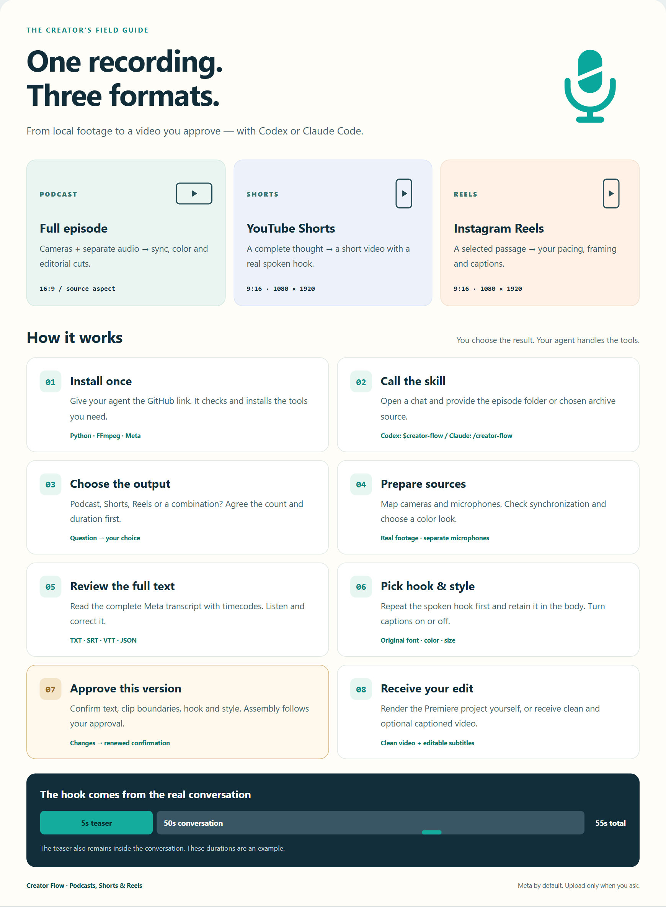

# Creator Flow — complete user guide

[ქართული](USER_GUIDE.ka.md) · [Home](../README.md) · [Visual cards](assets/creator-flow-cards-en.png) · [Interactive guide — open the downloaded HTML](visual-guide.html)

**Creator Flow** prepares podcasts, YouTube Shorts and Instagram Reels from real recordings. A local agent runs the tools; you choose the deliverables, correct the transcript and confirm editorial decisions.



## 1. First time: install from chat

Use **local Codex or Claude Code** with filesystem and command access. A GitHub link in an ordinary browser chat does not grant access to your drive. Use your existing agent; this installer does not install Codex, Claude or Adobe.

Paste into chat:

```text
Install Creator Flow on this computer:
https://github.com/AvtandilMghebrishvili/creator-flow

Read START_HERE.md and docs/SETUP.md.
Reuse an existing checkout; do not create a duplicate.
Inspect and install the missing tools. Keep Meta Omnilingual ASR as the default.
I want podcasts, Shorts/Reels and YouTube archive tools.
Run the unified installer with archive support, then check both doctors.
Register creator-flow as a personal skill for this client using scripts/register_skill.py.
Preserve my existing instructions; back them up if an update is needed.
Tell me the installation location and invocation syntax. Do not process an episode yet.
```

The agent checks Python and FFmpeg/ffprobe, creates/reuses the checkout's `.venv`, installs Meta libraries and adds Node/yt-dlp for archive work. Working dependencies are reused. Model weights download for the first short ASR test; installed libraries alone do not prove model readiness or accuracy. Premiere automation needs the relevant MCP/plugin and an actual connection check. Adobe login or mandatory interactive steps may need your participation.

An episode folder is **not required for installation alone**. If you do not want YouTube archives, say so and omit `-WithArchive`.

## 2. Invoke the skill

| Where you type | Chat invocation |
| --- | --- |
| Codex | `$creator-flow` followed by your request |
| Claude Code | `/creator-flow` followed by your request |
| Plain language in either client | `Use the creator-flow skill. ...` |

Use `$` to select a Codex skill; CLI/IDE also offer `/skills`. Claude Code uses `/creator-flow`. These belong **in chat**; the terminal executable is `creator-flow`. [Official Codex guidance](https://learn.chatgpt.com/docs/build-skills), [official Claude Code guidance](https://code.claude.com/docs/en/skills).

Words such as “podcast,” “Shorts,” and “Reels” after the invocation describe your brief. They are not added CLI subcommands: `creator-flow reels` is not supported in a terminal.

For a new chat, open the intended episode project and supply its exact path. Personal registration makes the skill available outside this checkout. Without it, start in the Creator Flow checkout with its repo skill, or explicitly ask the agent to read the checkout's `START_HERE.md`. File access is still required.

## 3. Prepare your sources

Keep one episode's originals together. Names are flexible; subfolders are supported:

```text
Episode-01/
  cameras/
    guest-001.mov
    host-001.mp4
    wide-001.mp4
  audio/
    guest.wav
    host.wav
```

Not every file is required. Tell the agent which camera/microphone belongs to whom, include sequential recording parts, and identify separate recorder channels if applicable. With a single wide camera and shared mix, the agent asks who sits left/right and who speaks in timestamped examples; clean independent voices cannot be guaranteed.

Keep the checkout separate from recordings. Private media, transcripts and fonts must stay out of public Git. Episode state is stored under `.podcut/`.

## 4. Full podcast: recordings to Premiere

Codex example; in Claude Code replace the initial marker with `/creator-flow`:

```text
$creator-flow Let's edit a new podcast.
Folder: D:\Podcasts\Episode-01
guest-001.mov is the guest; host-001.mp4 is the host; wide-001.mp4 is the wide shot.
External audio: audio/guest.wav and audio/host.wav.
Start at the greeting and guest introduction; end at the farewell.
The footage is ungraded: show real color options first.
Show the complete Meta transcript with timecodes for corrections and confirmation.
Repeat an approved spoken teaser first and retain it later in the conversation.
Ask about captions. Preserve separate camera and microphone tracks.
Assemble in Premiere; I will render the full episode myself.
```

The agent maps sources, verifies sync near the start/middle/end, and checks clock drift. Color alternatives use **actual frames from your cameras**. Scratch camera audio supports analysis; separate microphones replace it in the final timeline when available.

Meta produces a draft. You review the whole transcript/timing, then hooks, cuts and caption choices. After confirmation the agent assembles the project. Native Premiere delivery requires saving `.prproj`, reopening it and checking media links, tracks and playback. XML alone is an exchange package. [Premiere details](PREMIERE.md).

## 5. YouTube Shorts: find complete short stories

```text
$creator-flow Make YouTube Shorts from this episode.
Folder: D:\Podcasts\Episode-01
Clean exported video: exports/episode-clean.mp4
Use Meta if we do not have a matching complete transcript.
Propose count and duration as a question and wait for my choice.
Show the complete transcript, then suggest self-contained passages.
Each clip should start with an approved real spoken teaser, repeated later in the body.
Ask whether I want captions and show original-font/color options.
Use vertical 9:16. I will confirm the selections before assembly.
```

The agent might ask: **“Shall we make three 45–60-second Shorts, or would you prefer another count/duration?”** Those are suggestions, not automatic defaults or platform limits. If you already provided the count/duration, your answer is reused.

Choose a complete thought with an interesting start, enough context and an ending. Candidate scores help prioritize review; they do not predict views. A full-frame inset on a blurred background can preserve a two-person wide shot. A center crop needs frame-by-frame editorial checking for the selected material. Technical validation and actual video/audio inspection both matter.

## 6. Instagram Reels: the same sources, a separate brief

```text
/creator-flow Prepare Instagram Reels from this episode.
Folder: D:\Podcasts\Episode-01
Clean video: exports/episode-clean.mp4
Language: Georgian. Format: 9:16.
Suggest count and duration, then wait for my answer.
Show the full timed transcript and offer passages and spoken hooks.
Repeat the hook at the beginning and retain it later in the conversation.
Agree captions on/off, original font, size and color with me.
Leave room for platform controls and keep faces inside the crop.
Let me review the results; do not automatically upload to Instagram.
```

This example is for Claude Code; use `$creator-flow` in Codex. Shorts and Reels share the reviewed clip module. There is no separate “Reels AI”: your brief, passage selection, pacing, framing and text placement drive the differences. Preview against the destination interface so its controls do not cover important text. A starting suggestion could be 15–45 seconds; you decide the final duration.

One approved clip may serve both platforms. Request separate approved versions for different crops, text or durations. Three clips delivered as clean and captioned copies are three pieces of content and six video files.

## 7. Review transcript, hook and captions

You see the **entire transcript**, not only selected quotes. Correct in chat, for example: `At 00:12:34 replace “X” with “Y”.` Or open local `review.html`, choose the video for listening, edit existing cues/times, and download the corrections JSON. Return that JSON or its path to the agent. Opening or editing the page does not approve production.

Example hook: source `00:12:10–00:12:15` becomes the first five seconds, followed by the body in its original order, including that passage again. Audio and subtitle times follow the video ordering. A 50-second body plus a five-second teaser totals 55 seconds.

Choose **captions on/off per video**. Real-font options include publisher Noto Sans Georgian, installed/licensed Sylfaen or Arial, or your own TTF/OTF. The agent checks actual glyph coverage and license conditions, then previews family, size, color and outline. No generated lettering is used as a caption font. [Fonts and the review page](CLIPS.md).

Example approval:

```text
I confirm the current complete transcript and corrected timings.
Use clips 1, 2 and 3 with the shown boundaries and repeated spoken hooks.
Enable captions on all three, using the previewed font and yellow style.
Assemble these versions and preserve clean copies too.
```

Changed text, timing, hooks or style requires confirmation of that changed version. The current module creates readable static phrase captions, not guaranteed word-aligned karaoke animation.

## 8. Deliverables and practical limits

| Output | Purpose |
| --- | --- |
| `*-clean.mp4` | Video without burned-in subtitles |
| `*-captioned.mp4` | Text is baked into pixels; use the clean copy to omit it |
| TXT / SRT / VTT / JSON | Transcript, timing, editing and reuse |
| `review.html` / review JSON | Full text, clip, hook and style review |
| Premiere `.prproj` | Editable project when native assembly has actually been completed and verified |

The local clip renderer requires **an already exported video and complete transcript on that exact video's clock**. In Premiere-only episode work, the agent must not render the full episode itself: use your export or separately assemble/verify clip sequences in Premiere. Timing edits in Premiere can invalidate an earlier transcript.

Clip MP4 output is H.264/AAC at 30 fps; vertical layouts are 1080×1920. The `source` layout preserves source proportions. Codec, frame-rate and RAW support are not universal. [Actual limitations](LIMITATIONS.md).

## 9. Start from a YouTube archive

```text
$creator-flow Find Shorts/Reels candidates in my channel archive.
Channel: https://www.youtube.com/@YOUR_HANDLE
Workspace: D:\CreatorProjects\Archive
Agree count and duration first. Use Meta for new transcription.
Check available captions against the source.
Show full text and candidate passages before I approve assembly.
```

Archive tools retrieve available captions, summarize channel data and shortlist passages. YouTube access and caption availability vary. Archive JSON is not directly a final clip transcript; timings must match the exact video. [Archive details](ARCHIVE.md).

## 10. Terminal installation and personal skill registration

These commands belong **in a terminal**. Chat markers `$creator-flow` and `/creator-flow` do not.

Windows, new checkout:

```powershell
git clone https://github.com/AvtandilMghebrishvili/creator-flow.git
cd creator-flow
.\Install.ps1 -WithArchive
.\.venv\Scripts\python.exe scripts/register_skill.py --client codex
.\.venv\Scripts\creator-flow.exe doctor
.\.venv\Scripts\creator-flow.exe archive doctor
```

Use `--client claude` for Claude Code or `--client both` for both. Omit `-WithArchive` if you only need local episode/clip work.

macOS/Linux:

```sh
git clone https://github.com/AvtandilMghebrishvili/creator-flow.git
cd creator-flow
python3 scripts/install.py --with-archive
.venv/bin/python scripts/register_skill.py --client claude
.venv/bin/creator-flow doctor
.venv/bin/creator-flow archive doctor
```

Registration creates a small personal `SKILL.md` pointing to the **complete checkout**. It reuses an existing Creator Flow skill location; new Codex registrations use `~/.agents/skills`, Claude uses `~/.claude/skills`, and an established legacy Codex location is supported. `--check` is read-only. A differing existing file is preserved unless `--replace` is supplied; replacement saves a backup. The agent should inspect and preserve custom instructions first. `--skills-dir` selects a custom directory. Registration does not install dependencies: run the installer first.

## 11. Update, resume and troubleshoot

- **Update:** run `git pull --ff-only` in the checkout, then the same installer. Preserve and reconcile local changes if they block updating. Reregister if the checkout moves; a moved virtual environment may need repair.
- **Resume in a new chat:** `Use creator-flow. Continue D:\Podcasts\Episode-01 from its existing .podcut state, preserving prior choices.` Use a new folder for a new episode; never inherit the previous guest/source mappings.
- **Skill missing:** check the repo or personal registration and refresh/reopen the client. You can explicitly supply the full `START_HERE.md` path while resolving discovery.
- **Command not found:** use the environment executable's full path from the examples. Chat invocation and terminal PATH are separate.
- **FFmpeg/Node/Meta fails:** run the relevant doctor or installer `--check`, then give the agent the result. Meta is not silently replaced with Whisper.
- **Transcript drift:** verify the exact export and clock. Source and edited video timestamps often differ.
- **Premiere unavailable:** the agent must distinguish an XML handoff from a completed native project.

Agent entry point: [START_HERE.md](../START_HERE.md). Technical procedures: [WORKFLOW.md](WORKFLOW.md), [CLIPS.md](CLIPS.md), [SETUP.md](SETUP.md).
