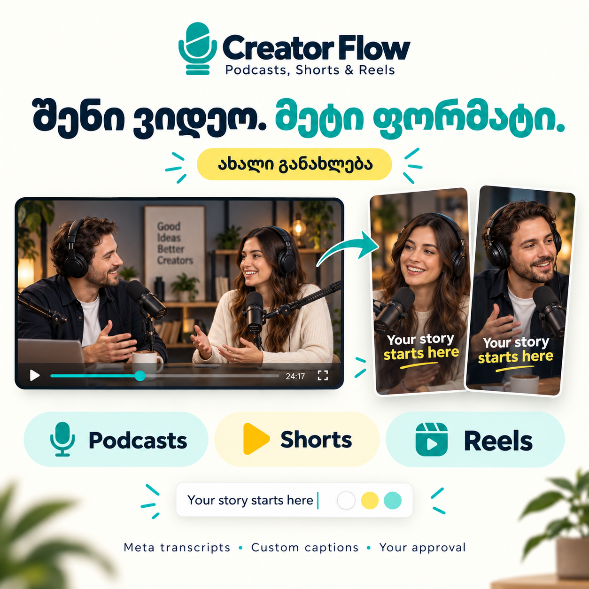

# Facebook პოსტი — Creator Flow-ის განახლება

[ქავერის PNG](../assets/creator-flow-facebook-update.png) · [მხოლოდ პოსტის ტექსტი, დასაკოპირებლად](facebook-update.ka.txt) · [ტიტრების ვიზუალური ახსნა](../USER_GUIDE.ka.md#caption-style)

ეს არის გამოსაქვეყნებლად მომზადებული პაკეტი; Facebook-ზე არ გამოქვეყნებულა. ქავერის ადამიანები და სტუდია შექმნილი ილუსტრაციაა და რეალურ მომხმარებლებს არ ასახავს.

## პოსტის ტექსტი

Creator Flow-ს ახალი განახლება დავამატე 🚀

შენი ვიდეო. მეტი ფორმატი.

პოდკასტის ჩანაწერები გაქვს და აწყობა გინდა? თუ ვიდეო უკვე მზადაა და მისგან Shorts / Reels გჭირდება? ახლა ორივე ფლოუ ერთ პროექტშია — Creator Flow-ში.

🎬 ჩანაწერებიდან სრულ ეპიზოდამდე — კამერებისა და ცალკე ხმების სინქრონიზაცია, ფერის ვარიანტები და მონტაჟი. შეგიძლია Premiere-ში აწყობილი პროექტი მიიღო და საბოლოო რენდერი თავად გააკეთო.

✂️ მზა ვიდეოდან Shorts / Reels — ვარჩევთ დამოუკიდებლად გასაგებ მონაკვეთებს, ვათანხმებთ რაოდენობასა და ხანგრძლივობას და დასაწყისში რეალურ ჰუკს ვამატებთ. ჰუკი მოგვიანებით საუბარშიც რჩება.

📝 Meta Omnilingual ქმნის ტრანსკრიპტს. აწყობამდე ხედავ სრულ ტექსტს ტაიმკოდებით, ასწორებ და ადასტურებ.

🎨 ტიტრებს შენს სტილზე აწყობ: ნამდვილი ქართული ან ინგლისური ფონტი — ან შენი მოწოდებული ფაილი; ზომა, ტექსტის ფერი, კონტურის ფერი და სისქე. შეგიძლია White / Yellow / Mint ვარიანტით დაიწყო ან საკუთარი ფერები აირჩიო.

⚙️ სტილს ერთხელ ირჩევ და დადასტურების შემდეგ ის ამ ნაკრების ყველა ტექსტიან კლიპს ედება. თითო კლიპზე თავად ირჩევ ტიტრების ჩართვას; სუფთა ვიდეო და ცალკე სუბტიტრების ფაილებიც გრჩება.

📖 დავამატე ქართული და ინგლისური ინსტრუქციები, ვიზუალური ბარათები და ჩათში ჩასასმელი მზა მაგალითები — დაყენებიდან პირველ ვიდეომდე.

როგორ იწყებ? გახსნი კომპიუტერზე მომუშავე Codex-ს ან Claude Code-ს, ჩაუგდებ GitHub-ის ბმულს და სთხოვ დაყენებას. შემდეგ მიუთითებ შენი ჩანაწერების ფოლდერს ან უკვე მზა ვიდეოს. Skill-ის დაყენების შემდეგ ჩათში იძახებ:
Codex → $creator-flow
Claude Code → /creator-flow

არჩევანსა და საბოლოო დასტურს შენ აკეთებ, ტექნიკურ ნაბიჯებს — აგენტი.

კოდი და ინსტრუქციები აქაა 👇
https://github.com/AvtandilMghebrishvili/creator-flow

#CreatorFlow #პოდკასტი #ვიდეომონტაჟი #Shorts #Reels

## ფოტოს ალტერნატიული აღწერა

Creator Flow-ის ქავერი ღია ფონზე: გამოგონილი ორი წამყვანის ფართო პოდკასტის კადრიდან ისარი მიდის ორ ვერტიკალურ ვიდეომდე. სათაური: „შენი ვიდეო. მეტი ფორმატი.“ ნაჩვენებია Podcasts, Shorts, Reels და თეთრი, ყვითელი, პიტნისფერი ტიტრების ვარიანტები.

## English asset note

Ready-to-copy Georgian announcement and square Facebook artwork. No social upload was performed. The fictional podcast scene illustrates source-to-clip editing and caption styling; it is not a screenshot, testimonial or example from a real episode. Details remain subject to the documented source, review and delivery requirements.
